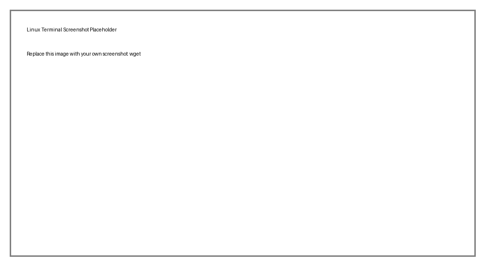

# 🔹 Network Commands

Practical Linux command notes with screenshots. Replace the placeholder images in the `images/` folder with your own terminal screenshots.

## `ip addr`

Show network interfaces and IP addresses.

```bash
ip addr
```


## `ip route`

Show the routing table.

```bash
ip route
```


## `ping google.com`

Test network connectivity.

```bash
ping google.com
```


## `ss -tuln`

Display network sockets and listening ports.

```bash
ss -tuln
```


## `curl https://example.com`

Make HTTP/network requests.

```bash
curl https://example.com
```


## `wget https://example.com/file.zip`

Download files from the network.

```bash
wget https://example.com/file.zip
```



## `hostname`

Show the system hostname.

```bash
hostname
```


## `nslookup example.com`

Query DNS information.

```bash
nslookup example.com
```


## `dig example.com`

Perform DNS lookups (if installed).

```bash
dig example.com
```


## `traceroute example.com`

Trace the route to a host (if installed).

```bash
traceroute example.com
```


## `ssh user@server-ip`

Connect securely to a remote machine.

```bash
ssh user@server-ip
```


## `scp file.txt user@server:/home/user/`

Securely copy files over SSH.

```bash
scp file.txt user@server:/home/user/
```


