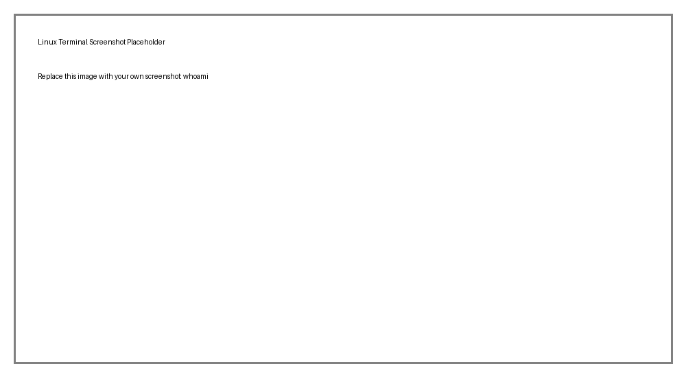

# 🔹 User Management Commands

Practical Linux command notes with screenshots. Replace the placeholder images in the `images/` folder with your own terminal screenshots.

## `whoami`

Show the current user.

```bash
whoami
```



## `id`

Show user and group IDs.

```bash
id
```


## `who`

Show logged-in users.

```bash
who
```


## `w`

Show logged-in users and their activity.

```bash
w
```


## `groups`

Show groups for a user.

```bash
groups
```


## `passwd`

Change a user's password.

```bash
passwd
```


## `su username`

Switch to another user.

```bash
su username
```


## `sudo command`

Run a command with elevated privileges.

```bash
sudo command
```


## `sudo useradd username`

Create a user (administrative use).

```bash
sudo useradd username
```


## `sudo usermod -aG group username`

Modify a user account.

```bash
sudo usermod -aG group username
```


## `sudo userdel username`

Delete a user account.

```bash
sudo userdel username
```


## `sudo groupadd developers`

Create a group.

```bash
sudo groupadd developers
```


## `sudo groupdel developers`

Delete a group.

```bash
sudo groupdel developers
```


